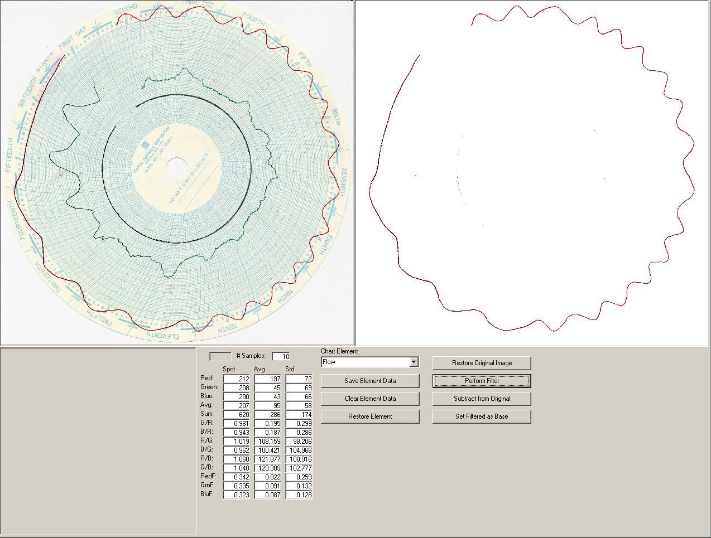



## A Heuristic Graphic Filter

### Description

What the heck is a heuristic graphic filter? In this case, heuristic means a technique in which a computer works along empirical methods, using rules of thumb, to find solutions or answers. The application described here is to have the computer “recognize“ a parameter from a graphic image.

It is a simple task for most people to identify a red line on a chart. But this task is not so easy for a computer. The reason is “red” is not always = RGB(255, 0, 0). When the red line is drawn by a pen and optically scanned, red turns out to be various shades red, pink, purple, and orange. The trick here is to “train” the computer as to what you would call the red line. In this specific example, we do this by deconstructing the selected color into its red, green, and blue components. Various statistical calculations are performed on that data and saved as a template that represents a range of colors defined as “red”. Once the color(s) are defined, graphical filtering and manipulation can be performed to add, subtract, or just identify the selected color.
 
### More Info
 
Note that this application requires a reference to MS ADO 2.6. It works best at screen resolutions greater than 1028 X 1024. API Calls tested on Win 2000.

             |
---                |---
**Submitted On**   |2003-04-04 15:36:52
**By**             |[G Choquette](https://github.com/Planet-Source-Code/PSCIndex/blob/master/ByAuthor/g-choquette.md)
**Level**          |Advanced
**User Rating**    |4.8 (63 globes from 13 users)
**Compatibility**  |VB 6\.0
**Category**       |[Graphics](https://github.com/Planet-Source-Code/PSCIndex/blob/master/ByCategory/graphics__1-46.md)
**World**          |[Visual Basic](https://github.com/Planet-Source-Code/PSCIndex/blob/master/ByWorld/visual-basic.md)
**Archive File**   |[A\_Heuristi156918442003\.zip](https://github.com/Planet-Source-Code/g-choquette-a-heuristic-graphic-filter__1-44506/archive/master.zip)

